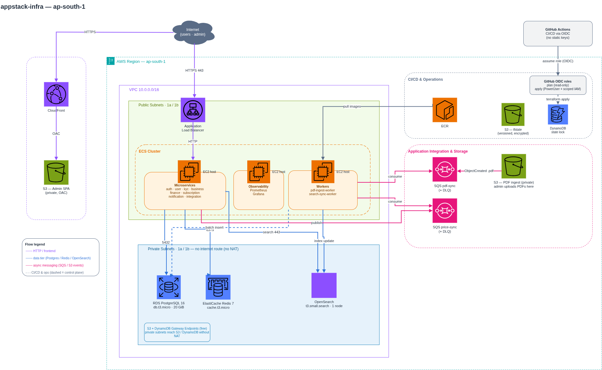

# AppStack — Microservices Platform (AWS Infrastructure, Terraform)

Infrastructure-as-Code for a product search & management platform
(.NET microservices, Angular admin panel, React Native app). Built on AWS with
a **lowest-cost focus**, fully modular Terraform.

Region: `ap-south-1` · IaC: Terraform (AWS provider `~> 5.0`) · Custom VPC (no
default VPC used anywhere)

---

## Architecture



Everything lives in a **dedicated `10.0.0.0/16` VPC** across 2 AZs:

- **Public subnets** — ALB + the ECS EC2 host (public IP, but locked down by
  security group). This is what faces the internet.
- **Private subnets** — RDS, ElastiCache, OpenSearch. No route to the internet
  at all (no NAT). They only talk to ECS.
- **No default VPC** — the module builds its own VPC, IGW, subnets, route tables,
  and security groups. `terraform destroy` removes all of it cleanly.

---

## Runnable demo application (`app/`)

The `app/` directory holds a working implementation of the platform — an
**internal MRO spare-parts store** — that runs the *entire* architecture locally
with Docker Compose, against the **same components** the Terraform provisions
(real OpenSearch, real SQS/S3 via LocalStack — no substitutes), at **zero AWS cost**.

```bash
cd app && docker compose up --build
# admin panel: http://localhost:8090  (admin@appstack.local / Admin123!)
# Grafana: http://localhost:3000 · Prometheus: http://localhost:9090
```

16 containers: 8 .NET microservices + 2 SQS workers, Postgres, OpenSearch,
LocalStack (SQS+S3), Prometheus + Grafana, and an nginx gateway that stands in
for the ALB path-routing and the CloudFront/S3 SPA origin. Both event pipelines
(`price-sync` → OpenSearch, S3 `pdf-ingest` → Postgres) work end-to-end. See
[`app/README.md`](app/README.md) for the full walkthrough.

### Deployed & validated on AWS (GitOps)

The same app has been **provisioned and verified end-to-end on real AWS**. A merge
to `main` runs one pipeline (`apply.yml`):

```
terraform apply → publish SPA to S3 + CloudFront invalidate
               → build & push 11 images to ECR
               → db-migrate (schema/seed into RDS, one-shot ECS task)
               → roll the 10 ECS services
```

- The `ecs_services` module turns the cluster into running services: per-service
  ECS task definitions, services, ALB target groups + path rules.
- **CloudFront serves the SPA (S3) and the API (ALB) from one origin → no CORS.**
- Validated live through the CloudFront URL: login, OpenSearch search, catalog,
  suppliers, requisition approve (stock deduct), inventory, low-stock alerts, and
  the CSV bulk-upload pipeline (S3 → SQS → worker → Postgres → search).
- Free-tier friendly (4× t3.micro hosts) and torn down with `destroy.yml`.

---

## How it all works together

The platform has **two planes**: a synchronous request plane (user → API → data)
and an asynchronous event plane (SQS workers). They are intentionally separated.

### 1. Synchronous request plane

```
User / Admin → CloudFront ─(static SPA)→ S3
            → ALB ─(HTTP)→ ECS service ─→ Redis (cache)
                                        ─→ OpenSearch (reads/search)
                                        ─→ Postgres (writes)
```

- The **Angular admin SPA** is static files in a private S3 bucket, served by
  **CloudFront** via Origin Access Control (OAC). S3 is never public; only this
  one CloudFront distribution can read it. 403/404 fall back to `/index.html` so
  client-side routing works.
- The **React Native app** and admin SPA call the API through the **ALB**. The
  ALB is the only thing in front of ECS; the ECS security group accepts traffic
  **only from the ALB's security group**.
- **.NET microservices** run as containers on a single **ECS-on-EC2** host. They
  read/write Postgres, use Redis for caching/sessions, and query OpenSearch for
  search. **Search requests hit OpenSearch only — never Postgres.**

### 2. Asynchronous event plane

```
A) Admin uploads PDF  → S3 (ObjectCreated) → SQS pdf-ingest → pdf-ingest-worker → Postgres
B) Service writes price → SQS price-sync   → search-sync-worker → OpenSearch
```

- **PDF ingestion** — admin uploads a 5–6k-item PDF to the PDF S3 bucket. S3
  emits an `ObjectCreated` (`.pdf`) event straight to the `pdf-ingest` SQS queue.
  The `pdf-ingest-worker` (a container on ECS, **not** Lambda) parses it and
  batch-inserts into Postgres.
- **DB → Search sync** — when a microservice changes a price in Postgres it
  publishes a message to the `price-sync` queue. The `search-sync-worker`
  consumes it and updates the matching OpenSearch document. This keeps the search
  index eventually-consistent with the DB without coupling the write path to
  OpenSearch.
- Each queue has a **DLQ** (`maxReceiveCount` redrive) so poison messages don't
  loop forever.

### Why this shape

- **Reads are cheap and fast** — search served by OpenSearch, hot data by Redis,
  so Postgres handles writes + transactional reads only.
- **Spiky/heavy work is decoupled** — PDF parsing and index syncing run off
  queues, so an upload burst can't take down the API.
- **Workers are containers, not Lambda** — deliberately, to demonstrate
  ECS/queue-consumer patterns and stay inside the EC2 free tier.

---

## How the modules wire together

Modules are composed in `environments/dev/main.tf`. `vpc_network` is the root —
everything else consumes its subnet IDs and security-group IDs:

| Module                   | Consumes from `vpc_network`              | Produces                          |
|--------------------------|------------------------------------------|-----------------------------------|
| `ecr_registry`           | —                                        | 10 ECR repos (8 svc + 2 workers)  |
| `rds_postgres`           | `private_subnet_ids`, `data_sg_id`       | Postgres endpoint                 |
| `elasticache_redis`      | `private_subnet_ids`, `data_sg_id`       | Redis endpoint                    |
| `opensearch`             | `private_subnet_ids[0]`, `data_sg_id`    | Search domain endpoint            |
| `ecs_compute`            | `vpc_id`, `public_subnet_ids`, `alb_sg_id`, `ecs_sg_id` | ECS cluster, ASG, ALB DNS |
| `ecs_services`           | cluster, ALB listener, ECR URLs, DB/OpenSearch/SQS      | 10 task defs + services + TGs + path rules, db-migrate task |
| `s3_cloudfront_frontend` | `alb_dns_name` (API origin)              | CloudFront domain (SPA + API, one origin) |
| `sqs_messaging`          | — (own queues + PDF bucket)              | Queue URLs, worker IAM policy     |

### Security model (least privilege, layered SGs)

```
internet ──► ALB SG ──► ECS SG ──► Data SG (RDS / Redis / OpenSearch)
            :80/:443   from ALB    5432 / 6379 / 443  — from ECS only
```

- **ALB SG** — 80/443 from `0.0.0.0/0`.
- **ECS SG** — ingress only from the ALB SG.
- **Data SG** — Postgres/Redis/OpenSearch ports, ingress only from the ECS SG.
  No public IPs on any database.
- **Private access for ops** — **SSM Session Manager** (the ECS instance role has
  `AmazonSSMManagedInstanceCore`). No bastion, no VPN, no SSH keys.

---

## Cost strategy (free tier)

| Service | Choice | Free tier |
|---|---|---|
| Compute | ECS on **EC2 t3.micro** (not Fargate) | 750 hrs/mo |
| Database | RDS Postgres **db.t3.micro** single-AZ | 750 hrs, 20 GB |
| Cache | ElastiCache **cache.t3.micro** | 750 hrs |
| Search | OpenSearch **t3.small.search** single-node | 750 hrs, 10 GB |
| Frontend | S3 + CloudFront | 5 GB S3, 1 TB CF out |
| Messaging | SQS | 1M requests/mo |
| Registry | ECR (lifecycle: keep 5 images) | 500 MB |
| **NAT** | **None** — public-subnet ECS + S3/DynamoDB gateway endpoints | avoids ~$32/mo |
| Private access | **SSM Session Manager** (no VPN/bastion) | free |
| CI/CD | GitHub Actions + OIDC (no static keys) | free |

> The gateway endpoints (S3 + DynamoDB) are free and let the private route table
> reach those services without a NAT Gateway — that's the single biggest cost
> avoided in this stack.

---

## Layout

```
modules/
  vpc_network/            VPC, public/private subnets, IGW, gateway endpoints, SGs
  ecr_registry/           Per-service ECR repos + lifecycle policy
  rds_postgres/           Postgres (private, logical replication on)
  elasticache_redis/      Redis (private)
  ecs_compute/            ECS cluster, EC2 ASG, ALB, IAM (incl. SSM)
  ecs_services/           Per-service task defs + services + ALB target groups/rules + db-migrate
  s3_cloudfront_frontend/ Admin SPA: private S3 + CloudFront (S3 + ALB origins, no CORS)
  sqs_messaging/          price-sync + pdf-ingest queues, DLQs, PDF bucket events
  opensearch/             Full-text search domain (VPC, SG-locked)
environments/
  dev/                    Wires modules with free-tier sizes
app/                      Runnable MRO-store app (8 services + 2 workers + SPA)
bootstrap/                One-time S3 + DynamoDB remote state backend
.github/workflows/        plan (PR) · apply (merge → provision + deploy) · destroy (manual)
```

---

## Usage

### First-time setup

```bash
# 0. One-time: create the remote-state backend (S3 bucket + DynamoDB lock table)
cd bootstrap && terraform init && terraform apply

# 1. Per environment
cd ../environments/dev
export TF_VAR_db_password='<strong-password>'   # never commit; env var only
terraform init     # uses the S3 backend from step 0
terraform plan
terraform apply
```

### Variables

| Name           | Default        | Notes                                          |
|----------------|----------------|------------------------------------------------|
| `project_name` | `appstack`     | prefix on every resource name                  |
| `region`       | `ap-south-1`   | —                                              |
| `vpc_cidr`     | `10.0.0.0/16`  | dedicated VPC CIDR                             |
| `az_count`     | `2`            | AZs (ALB requires ≥ 2)                          |
| `db_password`  | *(required)*   | RDS master password — `TF_VAR_db_password` only |

---

## Going from infra to a real running platform

This repo provisions the **platform**, not the application images. To run a real
workload on top:

1. **Build & push images** — `docker build` each .NET service, tag, and push to
   its ECR repo (`terraform output` lists the repo URLs). Workers
   (`pdf-ingest-worker`, `search-sync-worker`) push the same way.
2. **Add ECS task definitions + services** (deferred in this repo) — one task def
   per service pointing at its ECR image, registered to the ECS cluster, fronted
   by an ALB target group + listener rule (path-based routing per service). Inject
   config via task-def env vars / SSM Parameter Store:
   - DB host = RDS endpoint output, secret = `db_password`
   - Redis host = ElastiCache endpoint output
   - OpenSearch host = domain endpoint output
   - Queue URLs = SQS outputs
3. **Wire the workers to the queues** — the `sqs_messaging` module already emits
   an IAM policy granting consume/send on the right queues + read on the PDF
   bucket; attach it to the worker task role.
4. **Deploy the admin SPA** — `ng build`, sync `dist/` to the frontend S3 bucket,
   invalidate the CloudFront distribution.
5. **Point the mobile app + admin SPA** at the ALB DNS name (or a Route 53 record
   / ACM cert in front of it for HTTPS).
6. **Observability** — run Prometheus + Grafana as containers on ECS; scrape the
   services + node exporter. (Self-hosted to stay free.)

### Promoting to production (beyond free-tier)

- Add an `environments/prod/` that reuses the same modules with bigger sizes:
  multi-AZ RDS, ≥2 ECS hosts behind the ASG, OpenSearch with 2+ data nodes.
- Put **HTTPS** on the ALB (ACM cert) and redirect 80→443.
- Move to **private ECS subnets + NAT** (or VPC endpoints for ECR/CloudWatch/SSM)
  once cost is no longer the priority.
- Tighten OpenSearch access policy and enable fine-grained access control.

---

## CI/CD

`.github/workflows/` (OIDC — no static AWS keys):

- **`plan.yml`** — runs `terraform plan` read-only on pull requests.
- **`apply.yml`** — runs `terraform apply` on merge to `main`, gated by a
  `production` GitHub environment approval.
- **`destroy.yml`** — `workflow_dispatch` only; requires typing a confirmation
  string. Never runs automatically.

Required repo secrets: `AWS_PLAN_ROLE_ARN`, `AWS_APPLY_ROLE_ARN`,
`TF_VAR_DB_PASSWORD`. The two role ARNs are IAM roles with a GitHub OIDC trust
policy (not yet provisioned — see roadmap).

## Roadmap

- [ ] OIDC IAM roles + GitHub environment/secrets so the workflows can run
- [ ] ECS task definitions + services + ALB listener rules per microservice
- [ ] Prometheus + Grafana self-hosted stack
- [ ] `environments/prod/` with production sizing

